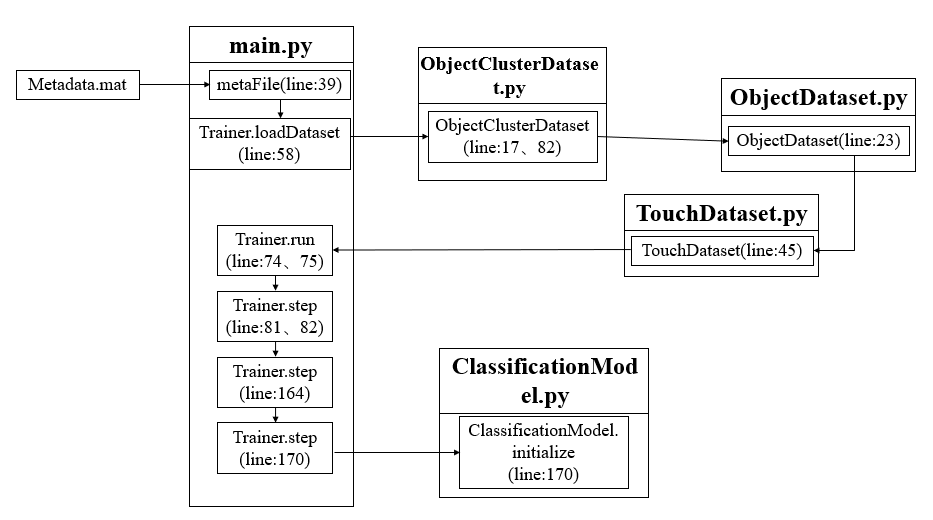
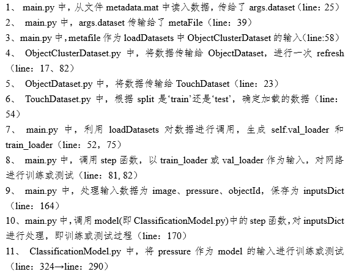

## This code is modified from "Learning the signatures of the human grasp using a scalable tactile glove" by Jerry
The basic idea is to add attention mechanism to the original method, experiments show that this operation can increase the accuracy rate to more than 90%
Most  modification can be found in ClassificationModel.py

## Introduction
This is a Pytorch based code for object classification and object estimation methods presented in the paper "Learning the signatures of the human grasp using a scalable tactile glove".

It relies on Pytorch 0.4.1 (or newer) and the dataset that can be downloaded separately from [http://humangrap.io](http://humangrap.io) .


## System requirements

Requires CUDA and Python 3.6+ with following packages (exact version may not be necessary):

* numpy (1.15.4)
* torch (0.4.1)
* torchfile (0.1.0)
* torchvision (0.2.1)
* scipy (1.1.0)
* scikit-learn (0.19.1)

## Dataset preparation

1. Download the `classification` and/or `weights` dataset from [http://humangrap.io](http://humangrap.io) .
2. Extract the dataset metadata.mat files to a sub-folder `data\[task]`. The resulting structure should be something like this:
```
data
|--classification
|    |--metadata.mat
|--weights
        |--metadata.mat
```
The images in the dataset are for illustration only and are not used by this code. More information about the dataset structure is availble in [http://humangrap.io](http://humangrap.io) .

3. Alternatively, extract the dataset to a different folder and use a runtime argument `--dataset [path to metadata.mat]` to specify its location.

## Object classification

Run the code from the root working directory (the one containing this readme).

### Training
You can train a model from scratch for `N` input frames using:
```
python classification/main.py --reset --nframes N
```
You can change the location of the saved snapshots using `--snapshotDir YOUR_PATH`.

### Testing
You can test the provided pretrained model using:
```
python classification/main.py --test --nframes N
```

## History
Any necessary changes to the dataset will be documented here.

* **May 2019**: Original code released.

## Terms
Usage of this dataset (including all data, models, and code) is subject to the associated license, found in [LICENSE](http://humangrasp.io/license.html). The license permits the use of released code, dataset and models for research purposes only.

We also ask that you cite the associated paper if you make use of this dataset; following is the BibTeX entry:

```
@article{
	SSundaram:2019:STAG,
	author = {Sundaram, Subramanian and Kellnhofer, Petr and Li, Yunzhu and Zhu, Jun-Yan and Torralba, Antonio and Matusik, Wojciech},
	title = {Learning the signatures of the human grasp using a scalable tactile glove},
	journal={Nature},
	volume={569},
	number={7758},
	year={2019},
	publisher={Nature Publishing Group}
	doi = {10.1038/s41586-019-1234-z}
}
```
## 数据流

理清输入数据的数据流向，该网络的输入数据为Metadata.mat，数据流向大体如图所示：



///注释：



## Hiya's modification description

### 1. 源代码中的bug修改

源代码中的bug修改主要在3个地方：

（1）main.py文件中

```
parser.add_argument('--dataset', default='/data/classification/metadata.mat', help="Path to metadata.mat file.")
```
修改为

```
parser.add_argument('--dataset', default='./data/classification/metadata.mat', help="Path to metadata.mat file.")
```
原因：原来的默认路径找不到文件。

（2）main.py文件中

```
parser.add_argument('--reset', type=str2bool, nargs='?', const=False, default=True, help="Start from scratch (do not load weights).")
```
修改为

```
parser.add_argument('--reset', type=str2bool, nargs='?', const=True, default=False, help="Start from scratch (do not load weights).")
```
原因：如果reset设置为false，则训练时会去加载训练好的模型，如果没有对应的模型就会报错，所以应该设置为true

（3）ClassificationModel.py文件中的accuracy函数中的

```
correct_k = correct[:k].view(-1).float().sum(0, keepdim=True)
```
修改为

```
correct_k = correct[:k].contiguous().view(-1).float().sum(0, keepdim=True)
```
### 2. 将代码修改为对3通道数据可训练的代码

改为3通道数据可训练的代码主要是要修改3个点：

（1）文件./shared/resnet_3x3.py中的ResNet函数中的

```
self.conv1 = nn.Conv2d(1, 64, kernel_size=3, stride=1, padding=1, bias=False) 
```
修改为 

```
self.conv1 = nn.Conv2d(3, 64, kernel_size=3, stride=1, padding=1, bias=False)
```
原因：将网络的输入由一维的改为三维的

（2）文件ClassificationModel.py中的TouchNet4函数中在

```
xi = x[:,i:i+1,...]
```
下面添加一行：

```
xi = torch.squeeze(xi, dim=1)
```
原因：将数据的维度保持为可训练的维度。

（3）文件./shared/dataset_tools.py中的_squeezeItem函数中将

```
elif item.dtype.type is np.str_: 
    item = str(item.squeeze()) 
```
两行注释掉

原因：这两行会导致数据集中的标签名字由原来的数组全部变为字符串，导致训练的标签出现混乱。

### 3. 修改绘制训练结果曲线图

在main.py中编写函数dawnplot函数，并在run函数中调用，放在self.doSink()后面；

### 4. 编写代码实现利用训练得到的模型对实时订阅的传感器数据进行分类识别

（1）添加文件Realtimedata.py，文件实现的功能是对在ros中订阅实时数据并输出数据到实时分类文件中；

（2）添加文件RealtimeClassify.py，文件实时利用Realtimedata.py订阅的实时数据作为输入，调用训练好的模型对实时数据进行分类；

（3）在ClassificationModel.py中添加函数step2。

### 5. cpu和gpu调用切换说明

在实时分类的时候应该数据量很小，有时候可能不用用到gpu，这时候可以将源代码中使用gpu的部分注释掉，具体地，将ClassificationModel.py中的
```
self.model.cuda()
```
注释掉，另外将
```
self.criterion = nn.CrossEntropyLoss().cuda()
```
修改为
```
self.criterion = nn.CrossEntropyLoss()
```


## Contact

Please email any questions or comments to [info@humangrasp.io](mailto:info@humangrasp.io).
